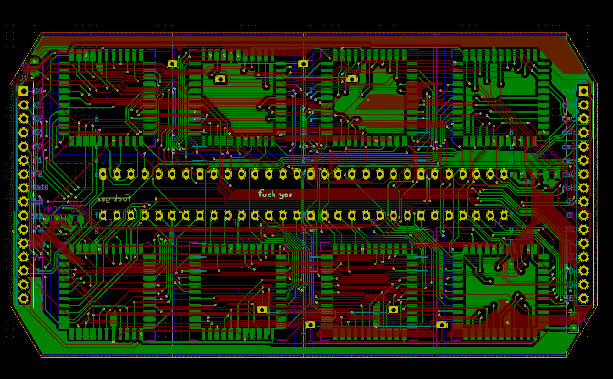
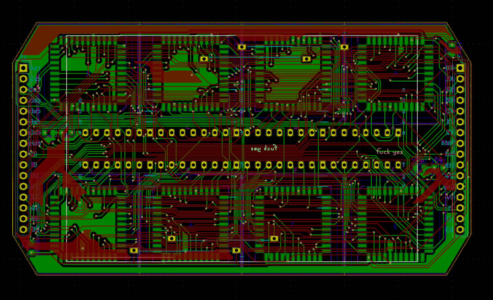
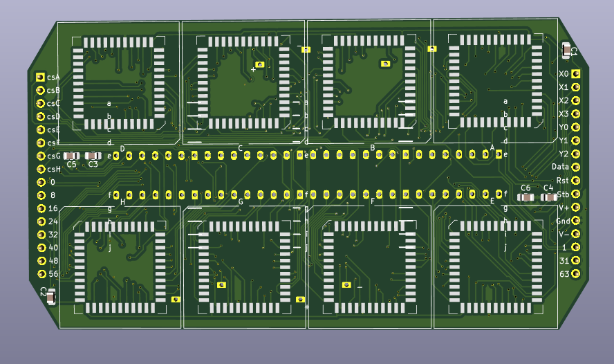
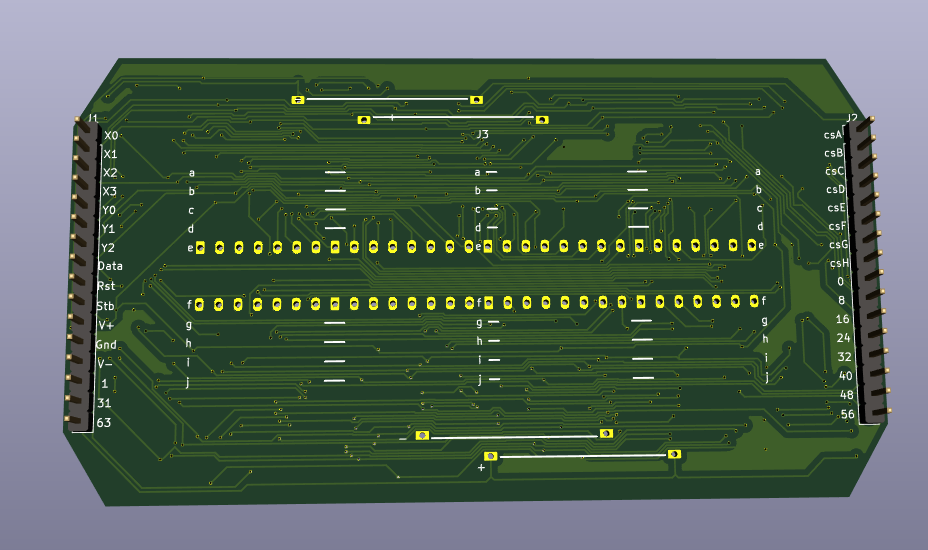
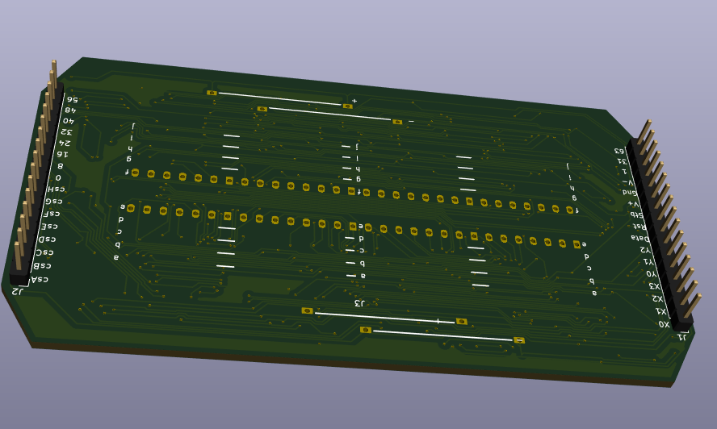
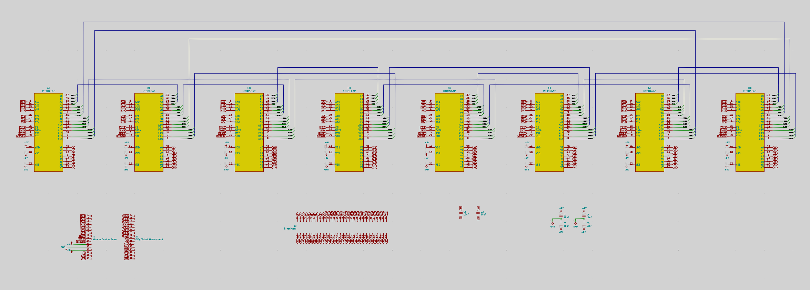
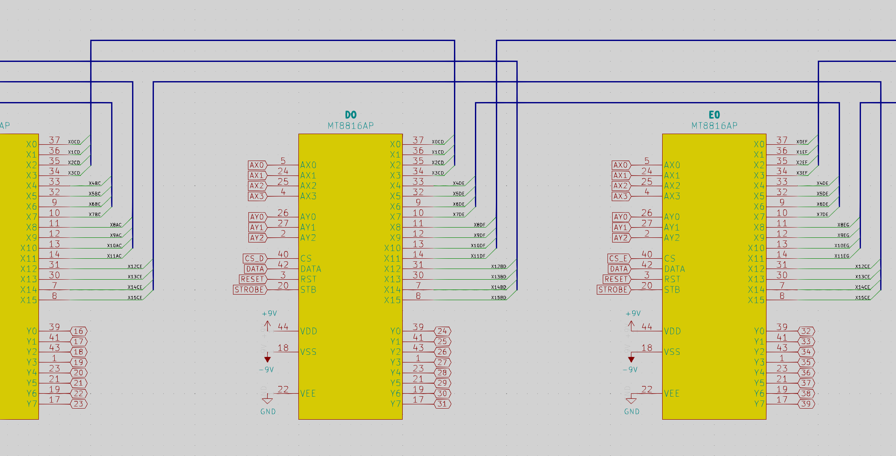
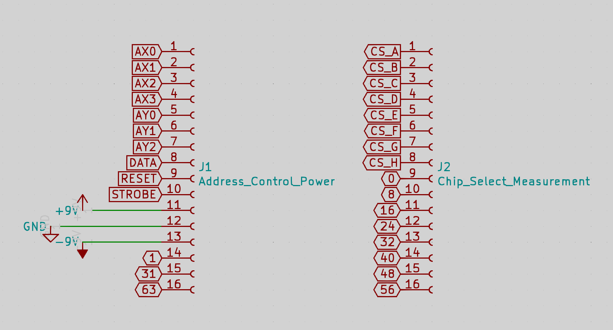

# breadWare

Hey guys, here's the PCB layout for the switch matrix board. Those holes should line up with the columns on a breadboard so this whole thing can be soldered directly onto the bottom. I just ordered 10 of these boards (in red!) so we can put a few together and then get on making those header pins on the sides do the correct things to make this work.

That white rectangle is roughly the size of a breadboard

Yes, these pin headers are on the wrong side but I'm not gonna let some stupid auto-generated 3D model tell me which side to solder them on. I might spend some time finding the 3D models for the PLCC sockets and a breadboard so this looks closer to the real thing

 Also, notice the silkscreened lines on the top and bottom are just a bit off from the holes, turns out the power rails on a breadboard arent spaced perfectly on the same grid as the rest of the pins. The line is marked where it would be if the universe made any sense

Those letters along the middle correspond to the row labels on a breadboard

Here's a zoomed out view of the whole schematic, those blue lines are busses, so they're actually 4 wires bundled together to make it look less messy. This is following JJ's brilliant idea for how to connect everything except I looped the ends back around so they conceptually should be thought of as a ring, If someone wants to map that out on one of those [Ring Lattice Graphs](https://i.imgur.com/oiiyKlz.png), it might make all this easier to visualize.

Here's a zoomed part so you can see how I named these interconnects, it goes Pin Name (X0, X1, etc.) then the letters of the two chips it's connecting (in alpabetical order). So the pin labeled X0CD connects pin X0 on chip C to pin X0 on chip D. I had to do this like 5 times to get the wires to always connect to the same pin on both chips, but it should make the software much easier to deal with. 

On the left we have the address lines, control lines and power input. Except for the last three with numbers, these are connected to all 8 chips together, so to make just the one we want to control do stuff, we use the Chip Select lines on the right side (labeled CS_A-H) which are wired to each chip individually. If the CS is logic 0 (~0 Volts, LOW, whatever), that chip will ignore everything that's put on the address and control lines because that signal isn't meant for it and these chips ain't no eavesdroppin' bitches. (just for everyone's learning, Chip Select lines seem to almost always be Active Low, meaning they'll ignore everything when that pin is held at logic 1 (5V or 3.3V depending on the chip) which is denoted with a line above, C̅S̅ (or /CS because overlining text is a pain in the ass on a computer. and it's typically spoken as "bar", so "CS Bar" in this case) this chip is unusual because it's Active High)

